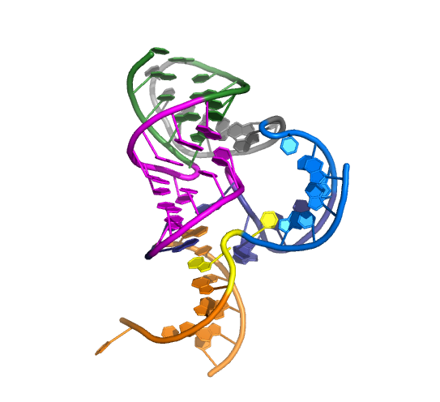
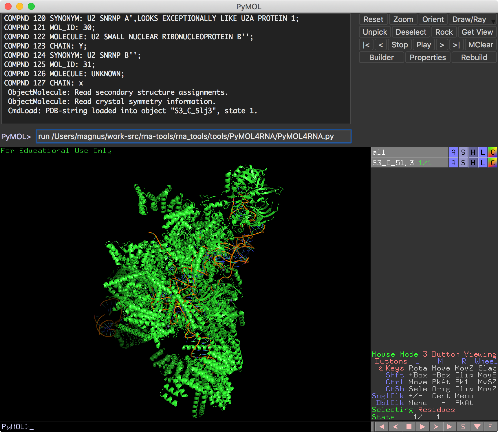

PyMOL4RNA
=========

To get:

(install the plugin) and run:

	PyMOL>rp
	PyMOL>rp17

The source of the pdb: <http://www.rcsb.org/pdb/explore/explore.do?structureId=5K7C> see also `test_data/5k7c_clean.pdb`

Install
-------------------------------------------------------------------------------

Add:

    sys.path.append('<path to the plugin>/PyMOL4RNA/')
    run <path to the plugin>/PyMOL4RNA/PyMOL4RNA.py

e.g.:

    sys.path.append('/Users/magnus/Dropbox/work/workspace/PyMOL4RNA/')
    run /Users/magnus/Dropbox/work/workspace/PyMOL4RNA/PyMOL4RNA.py

to our `~/.pymolrc`

Just Run the file
-------------------------------------------------------------------------------

To load the functions of `PyMOL4RNA.py`, type `run <path to the file of PyMOL4RNA.py>` in my case [1]:

and then open a given spliceosomal structure and type `spl color`:

This is a bit hacky way to do it. You must have only one structure open. The function `spl color` reads the name of the object (like in this case `5zwo`, so this object must include PDB ID) in your PyMOL session and based on that it colors the chains according to rules encoded in the function.

The implemented so far structures (based on PDB ID), colors and chains can be found here `pyMoL_colors-EMX.xlsx`.

    [1] run /Users/magnus/work-src/rna-tools/rna_tools/tools/PyMOL4RNA/PyMOL4RNA.py
